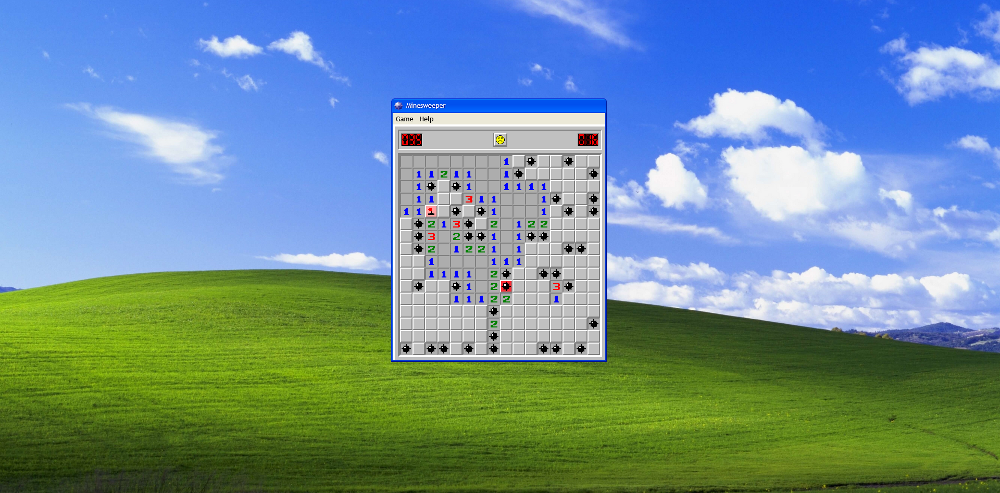

# Minesweeper
Minesweeper in the style of Windows XP. Made with Vue 3, Tailwind CSS, and Typescript.



## Project Setup

```sh
npm install
```

### Compile and Hot-Reload for Development

```sh
npm run dev
```

### Type-Check, Compile and Minify for Production

```sh
npm run build
```
